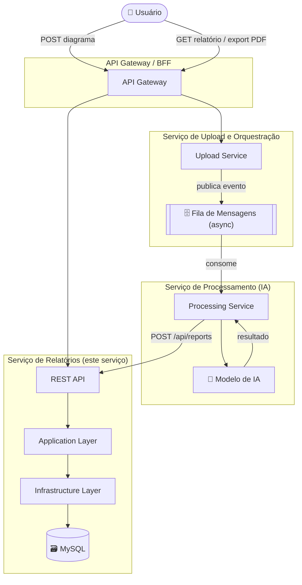

# Report Service — Serviço de Relatórios

Microsserviço responsável por receber os resultados de análise arquitetural (vindos do serviço de processamento com IA) e transformá-los em relatórios técnicos persistidos, consultáveis e exportáveis.

---

## Arquitetura

```
src/
├── ReportService.Api            → API REST, Swagger, health check, middleware
├── ReportService.Application    → casos de uso, validações, contratos
├── ReportService.Domain         → entidades e enums de negócio
└── ReportService.Infrastructure → persistência EF Core (MySQL)

tests/
├── ReportService.Tests          → testes unitários (xUnit + NSubstitute)
└── e2e/                         → scripts de teste end-to-end
```

---

## Diagrama de Arquitetura



> Diagrama completo com fluxo de sequência e arquitetura interna em [docs/architecture.md](docs/architecture.md)

---

## Fluxo de integração

O **serviço de processamento** realiza a análise com IA e ao finalizar faz uma chamada `POST /api/reports` para este serviço com o resultado estruturado.

```
[Serviço de Processamento] ──POST /api/reports──► [Report Service] ──► MySQL
```

---

## Endpoints

| Método | Rota | Descrição |
|--------|------|-----------|
| `POST` | `/api/reports` | Cria um relatório |
| `GET` | `/api/reports/{id}` | Busca por ID |
| `GET` | `/api/reports/by-analysis/{analysisProcessId}` | Busca pelo ID do processo de análise |
| `GET` | `/api/reports` | Lista com filtros opcionais |
| `GET` | `/api/reports/{id}/export/markdown` | Exporta o relatório em Markdown |
| `GET` | `/api/reports/{id}/export/json` | Exporta o relatório em JSON |
| `GET` | `/api/reports/{id}/export/pdf` | Exporta o relatório em PDF |
| `PATCH` | `/api/reports/{id}/status` | Atualiza o status do relatório |
| `GET` | `/health` | Health check |

---

## Executar localmente

### Pré-requisitos
- [.NET 9 SDK](https://dotnet.microsoft.com/download/dotnet/9)
- [Docker](https://www.docker.com/get-started) — para subir o MySQL

O serviço usa **MySQL 8.4**. A forma mais simples de rodar localmente é subir apenas o banco via Docker e executar a API pelo .NET:

```bash
# Terminal 1 — sobe o MySQL
docker compose up mysql

# Terminal 2 — restaura dependências e sobe a API
dotnet restore
dotnet run --project src/ReportService.Api
```

A API conecta em `localhost:3306` e aplica as migrations automaticamente na inicialização.

API disponível em: `http://localhost:5000`  
Swagger UI: `http://localhost:5000/swagger`

> **Connection string local** definida em `appsettings.Development.json` (não versionado).  
> Para customizar, edite esse arquivo ou exporte a variável de ambiente:  
> `ConnectionStrings__Default=Server=localhost;Port=3306;Database=reports;User=...;Password=...;`

---

## Executar com Docker

### Pré-requisitos
- [Docker](https://www.docker.com/get-started) instalado e rodando

```bash
docker compose up --build
```

O Docker Compose sobe o MySQL 8.4 e o serviço de relatórios. O serviço aguarda o MySQL estar saudável antes de iniciar e aplica as migrations automaticamente.

API disponível em: `http://localhost:8080`  
> O Swagger UI (`/swagger`) só está disponível no ambiente `Development`. Em produção (Docker padrão) use Postman ou curl para testar os endpoints.

---

## Testes unitários

```bash
dotnet test tests/ReportService.Tests
```

Cobre: criação de relatório, duplicatas, payloads inválidos, injeção HTML, exportação Markdown, enums de status e severidade.

---

## Teste End-to-End (E2E)

O teste E2E sobe um relatório real na API, valida todos os endpoints e exporta o relatório em Markdown. Com `pandoc` instalado, também gera um **PDF**.

### Pré-requisitos

| Ferramenta | Obrigatório | Instalação |
|------------|-------------|-----------|
| `curl` | Sim | Já incluso no Windows 10+, Mac e Linux |
| `jq` | Sim (bash) | `brew install jq` / `apt install jq` |
| `pandoc` | Não (para PDF) | [pandoc.org/installing.html](https://pandoc.org/installing.html) |

### Passo a passo

**1. Suba a API** (em outro terminal):

```bash
# Com Docker (recomendado)
docker compose up --build

# Ou localmente
dotnet run --project src/ReportService.Api
```

**2. Execute o teste E2E:**

```bash
# Linux / Mac
chmod +x tests/e2e/run-e2e.sh
./tests/e2e/run-e2e.sh

# URL personalizada (ex: Docker)
./tests/e2e/run-e2e.sh http://localhost:8080
```

```powershell
# Windows (PowerShell)
.\tests\e2e\run-e2e.ps1

# URL personalizada
.\tests\e2e\run-e2e.ps1 -BaseUrl http://localhost:8080
```

### O que o teste valida

| # | Teste |
|---|-------|
| 1 | Health check retorna 200 |
| 2 | Criação de relatório retorna 201 |
| 3 | Duplicata retorna 409 |
| 4 | Payload inválido retorna 400 |
| 5 | Busca por ID retorna 200 |
| 6 | Busca por `analysisProcessId` retorna 200 |
| 7 | Listagem retorna 200 |
| 8 | Atualização de status retorna 200 |
| 9 | Export JSON retorna 200 |
| 10 | Export Markdown salvo + PDF gerado (se pandoc instalado) |

### Saída esperada

```
=========================================
 Report Service — Teste E2E
 Base URL: http://localhost:8080
=========================================

► 1. Health check
[OK]  GET /health → 200

► 2. Criar relatório (POST /api/reports)
[OK]  POST /api/reports → 201 Created
   Report ID: 3fa85f64-...

...

=========================================
 Resultado: 10 OK  |  0 FALHAS
=========================================
```

Os arquivos `relatorio-{id}.md` e `relatorio-{id}.pdf` são gerados no diretório onde o script foi executado.

---

## Payload de exemplo (POST /api/reports)

```json
{
  "analysisProcessId": "3fa85f64-5717-4562-b3fc-2c963f66afa6",
  "sourceFileName": "diagrama-arquitetura.png",
  "components": [
    { "name": "API Gateway", "type": "Gateway", "description": "Ponto de entrada único para requisições externas" }
  ],
  "risks": [
    { "title": "Ponto único de falha", "severity": "High", "description": "API Gateway sem redundância", "recommendation": "Adicionar replicas com load balancer" }
  ],
  "recommendations": [
    { "title": "Observabilidade", "description": "Adicionar tracing distribuído com OpenTelemetry" }
  ],
  "aiModelInfo": {
    "provider": "OpenAI",
    "model": "gpt-4o",
    "promptVersion": "v1.0",
    "confidence": 0.88
  }
}
```

> `severity` aceita: `Low`, `Medium`, `High`, `Critical` (case-insensitive)  
> Todos os campos de texto: máx 500 caracteres, sem HTML ou scripts  
> `aiModelInfo` é opcional

---

## Segurança

### Validação de entradas

Toda entrada é validada no boundary HTTP antes de qualquer persistência:

- Campos textuais: sem HTML ou scripts (detecção via regex `<[^>]+>`), limite de 500 caracteres, não podem ser vazios
- `severity` e `status` validados contra os enums permitidos — valores fora do domínio retornam `400 Bad Request`
- `analysisProcessId` deve ser único — tentativa de duplicata retorna `409 Conflict` sem persistir nada

### Comunicação entre serviços

- Comunicação exclusivamente via REST sobre HTTP
- Nenhuma credencial ou dado sensível é trafegado nos endpoints
- `X-Correlation-Id` suportado para rastreamento de requisições entre serviços

### Tratamento seguro de falhas

- Stack traces **nunca** são expostos nas respostas — o handler global retorna apenas uma mensagem genérica (`INTERNAL_ERROR`)
- Payloads inválidos são rejeitados com `400` antes de qualquer operação no banco
- Erros de duplicata retornam `409` sem vazar informações sobre os dados existentes

### Uso controlado da IA

- Este serviço **não executa IA** — consome apenas o resultado já processado e validado pelo serviço de processamento
- O campo `aiModelInfo` registra qual modelo, versão de prompt e nível de confiança geraram a análise, permitindo rastreabilidade e auditoria futura

### Riscos e limitações conhecidos

| Risco | Impacto | Situação |
|-------|---------|----------|
| Endpoints sem autenticação/autorização | Qualquer chamante pode criar, ler ou alterar relatórios | Aceitável para MVP; em produção adicionar JWT ou API Key |
| Sem rate limiting | Suscetível a abuso por volume de requisições | Mitigar com API Gateway na frente do serviço |
| Credenciais do banco via variável de ambiente | Exposição se o ambiente não for gerenciado corretamente | Em produção usar secrets manager (ex: AWS Secrets Manager, Azure Key Vault) |

---

## CI/CD

Workflow em [.github/workflows/ci.yml](.github/workflows/ci.yml) com dois jobs:

### Build & Test
Executado em todo push e pull request para `main`:
1. Restore de dependências
2. Build em Release
3. Testes unitários com publicação de resultados

### Deploy
Executado apenas em push para `main`, após o Build & Test passar:
1. Login no GitHub Container Registry (GHCR)
2. Build da imagem Docker
3. Push da imagem com tags `latest` e `sha-<commit>`

A imagem fica disponível em:
```
ghcr.io/<org>/<repo>:latest
ghcr.io/<org>/<repo>:sha-<commit>
```

Para usar a imagem publicada localmente:
```bash
docker pull ghcr.io/<org>/<repo>:latest
docker run -p 8080:8080 \
  -e ConnectionStrings__Default="Server=<host>;Port=3306;Database=reports;User=<user>;Password=<password>;" \
  ghcr.io/<org>/<repo>:latest
```
