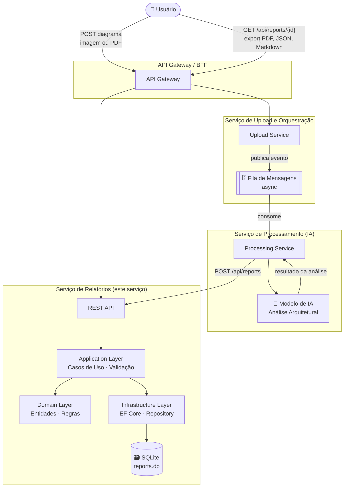
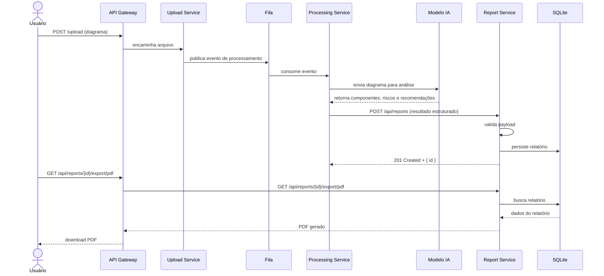
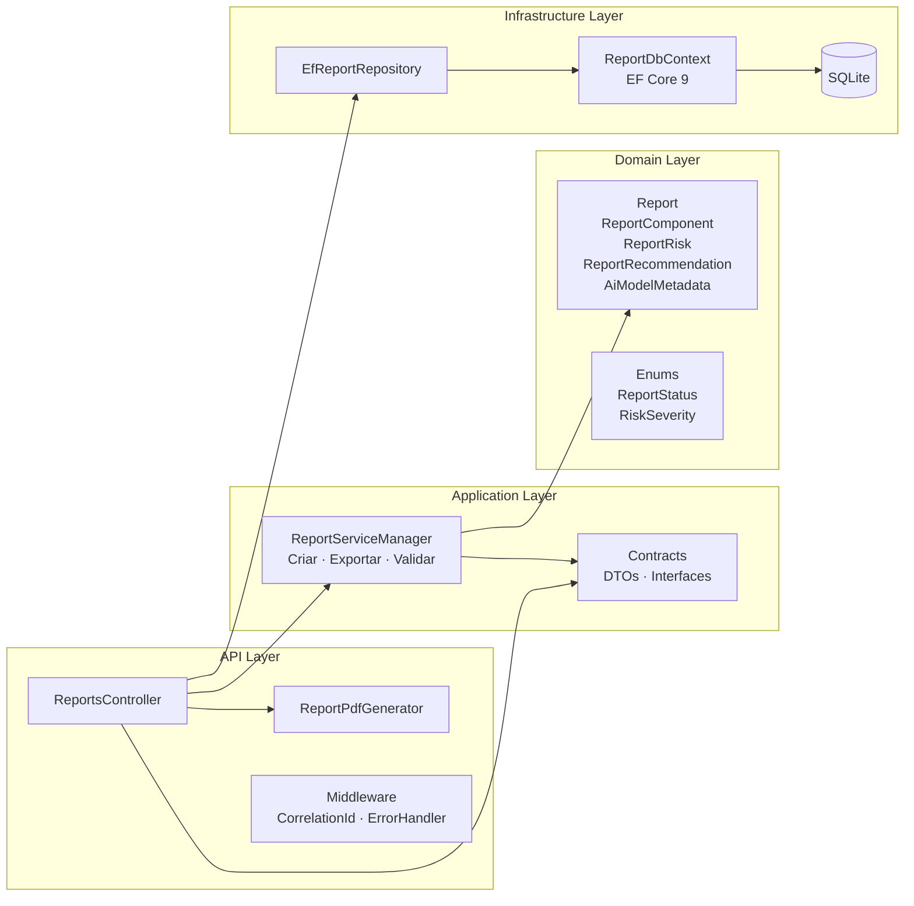
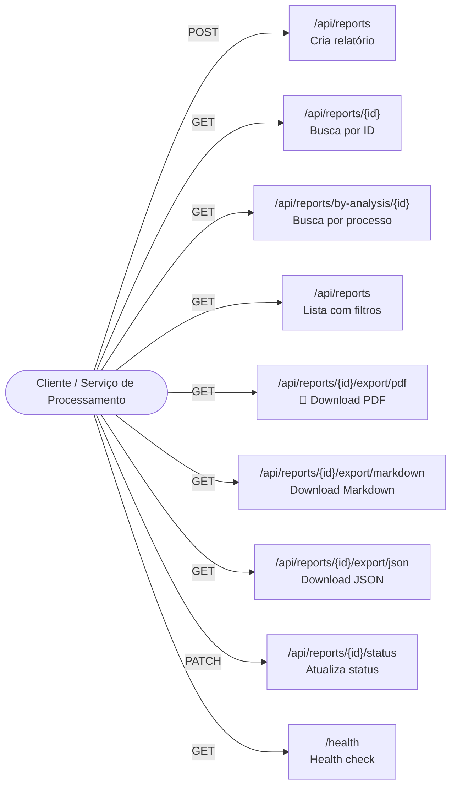

# Diagrama de Arquitetura — FIAP Secure Systems

## Visão geral do sistema

```mermaid
graph TD
    User(["👤 Usuário"])

    subgraph Gateway["API Gateway / BFF"]
        GW["API Gateway"]
    end

    subgraph Upload["Serviço de Upload e Orquestração"]
        UPL["Upload Service"]
        QUEUE[["🗄️ Fila de Mensagens\nasync"]]
    end

    subgraph Processing["Serviço de Processamento (IA)"]
        PROC["Processing Service"]
        AI["🤖 Modelo de IA\nAnálise Arquitetural"]
    end

    subgraph Reports["Serviço de Relatórios (este serviço)"]
        API["REST API"]
        APP["Application Layer\nCasos de Uso · Validação"]
        DOMAIN["Domain Layer\nEntidades · Regras"]
        INFRA["Infrastructure Layer\nEF Core · Repository"]
        DB[("🗃️ SQLite\nreports.db")]
    end

    User -->|"POST diagrama\nimagem ou PDF"| GW
    GW --> UPL
    UPL -->|"publica evento"| QUEUE
    QUEUE -->|"consome"| PROC
    PROC --> AI
    AI -->|"resultado da análise"| PROC
    PROC -->|"POST /api/reports"| API

    API --> APP
    APP --> DOMAIN
    APP --> INFRA
    INFRA --> DB

    User -->|"GET /api/reports/{id}\nexport PDF, JSON, Markdown"| GW
    GW --> API
```

---

## Fluxo principal

```mermaid
sequenceDiagram
    actor User as Usuário
    participant GW as API Gateway
    participant UPL as Upload Service
    participant Q as Fila
    participant PROC as Processing Service
    participant IA as Modelo IA
    participant RS as Report Service
    participant DB as SQLite

    User->>GW: POST /upload (diagrama)
    GW->>UPL: encaminha arquivo
    UPL->>Q: publica evento de processamento
    Q->>PROC: consome evento
    PROC->>IA: envia diagrama para análise
    IA-->>PROC: retorna componentes, riscos e recomendações
    PROC->>RS: POST /api/reports (resultado estruturado)
    RS->>RS: valida payload
    RS->>DB: persiste relatório
    RS-->>PROC: 201 Created + { id }

    User->>GW: GET /api/reports/{id}/export/pdf
    GW->>RS: GET /api/reports/{id}/export/pdf
    RS->>DB: busca relatório
    DB-->>RS: dados do relatório
    RS-->>GW: PDF gerado
    GW-->>User: download PDF
```

---

## Arquitetura interna do Report Service

```mermaid
graph LR
    subgraph Api["API Layer"]
        CTRL["ReportsController"]
        PDF["ReportPdfGenerator"]
        MW["Middleware\nCorrelationId · ErrorHandler"]
    end

    subgraph Application["Application Layer"]
        MGR["ReportServiceManager\nCriar · Exportar · Validar"]
        CONTRACTS["Contracts\nDTOs · Interfaces"]
    end

    subgraph Domain["Domain Layer"]
        ENT["Report\nReportComponent\nReportRisk\nReportRecommendation\nAiModelMetadata"]
        ENUMS["Enums\nReportStatus\nRiskSeverity"]
    end

    subgraph Infrastructure["Infrastructure Layer"]
        REPO["EfReportRepository"]
        CTX["ReportDbContext\nEF Core 9"]
        DB[("SQLite")]
    end

    CTRL --> MGR
    CTRL --> PDF
    CTRL --> CONTRACTS
    MGR --> ENT
    MGR --> CONTRACTS
    REPO --> CTX
    CTX --> DB
    CTRL --> REPO
```

---

## Endpoints disponíveis

```mermaid
graph LR
    Client(["Cliente / Serviço de Processamento"])

    Client -->|"POST"| E1["/api/reports\nCria relatório"]
    Client -->|"GET"| E2["/api/reports/{id}\nBusca por ID"]
    Client -->|"GET"| E3["/api/reports/by-analysis/{id}\nBusca por processo"]
    Client -->|"GET"| E4["/api/reports\nLista com filtros"]
    Client -->|"GET"| E5["/api/reports/{id}/export/pdf\n📄 Download PDF"]
    Client -->|"GET"| E6["/api/reports/{id}/export/markdown\nDownload Markdown"]
    Client -->|"GET"| E7["/api/reports/{id}/export/json\nDownload JSON"]
    Client -->|"PATCH"| E8["/api/reports/{id}/status\nAtualiza status"]
    Client -->|"GET"| E9["/health\nHealth check"]
```
